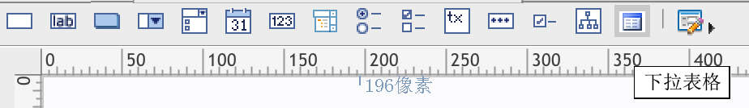
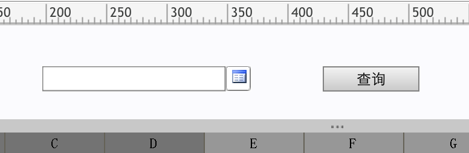
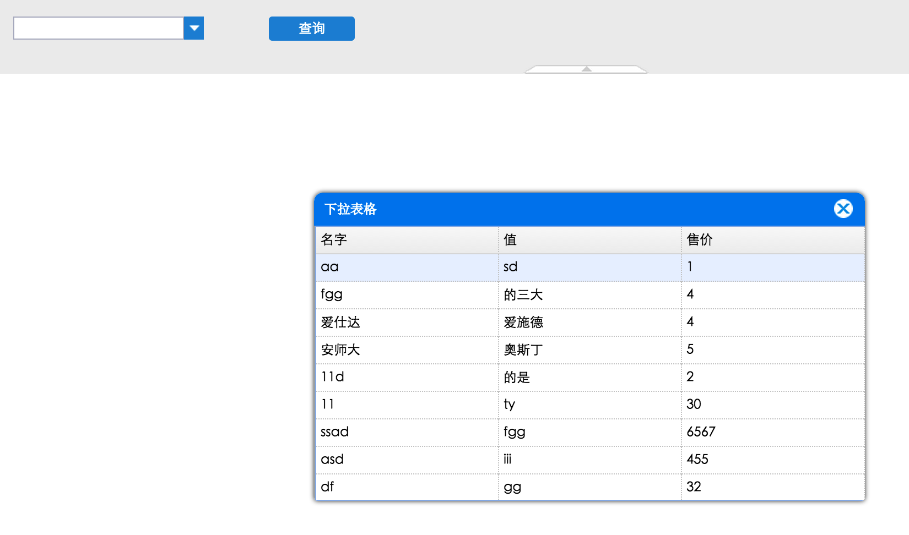

# 用于FineReport参数界面的下拉表格控件

## [插件构建指南](https://github.com/FineDevelop/plugin-build/blob/master/README.md)

可以用于参数面板上的弹出表格控件，可以比下拉框控件展示更详细的数据
使用的第三方表格控件easyui的datagrid控件来做表格展示

## 添加了插件后，参数面板上会多出一个“下拉表格”的控件

## 把控件拖拽添加到参数面板上后，在属性表界面，可以选择要使用的数据集

## 在参数界面上的效果如图,把控件名设置为c1,并在报表的一个格子中写上公式：=$c1

## 预览报表并点击下拉按钮看以看到弹出一个表格

## 选中需要的一行值后，点击查询按钮，可以看到参数值正确的在报表格子中显示了

